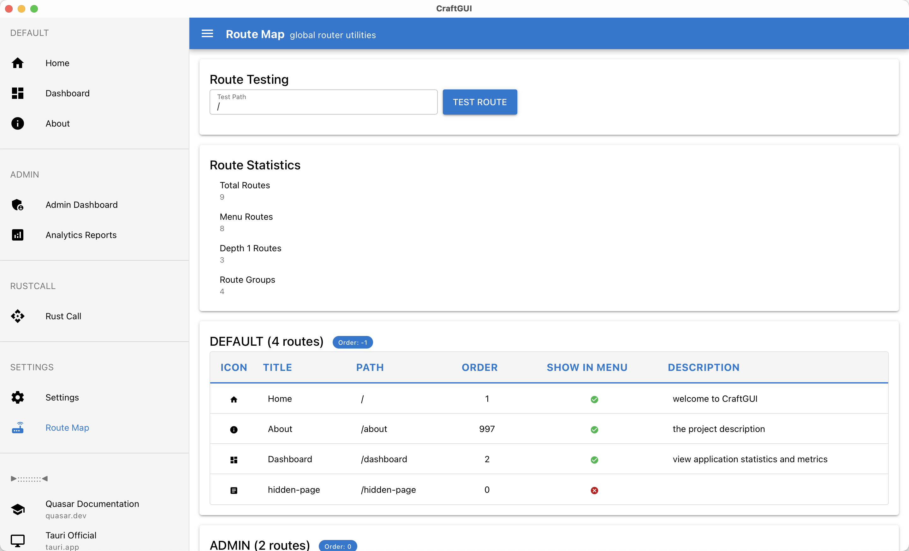

# CraftGUI

A cross-platform application templete built with Vue 3 + Quasar + Tauri.

<div align="center">
  
  
</div>

## Innovative Feature: Filename Prefix Routing Metadata Scheme

This project implements an innovative routing metadata definition scheme that automatically sets the `showInMenu` and `order` properties of routes through filename prefixes.

### Naming Rules

- `001.index.vue` → `showInMenu: true`, `order: 1`, route path: `/index`
- `002.dashboard.vue` → `showInMenu: true`, `order: 2`, route path: `/dashboard`
- `010.admin-home.vue` → `showInMenu: true`, `order: 10`, route path: `/admin/admin-home`
- `hidden-page.vue` → `showInMenu: false`, `order: 0`, route path: `/hidden-page`

### Advantages

1. **Simplified Development**: No need to repeatedly define `showInMenu` and `order` in each component
2. **Intuitive Ordering**: Menu order can be seen directly from the filename
3. **Enforced Standards**: No overrides allowed in components, ensuring naming convention consistency
4. **Consistency**: Unified naming conventions for better team collaboration

For detailed documentation, see: [Router System Documentation](./docs/ROUTER_SYSTEM.md)

## Development

```bash
# Install dependencies
pnpm install

# Start development server
pnpm dev

# Build application
pnpm build
```

## Tech Stack

- **Frontend Framework**: Vue 3
- **UI Framework**: Quasar
- **Desktop Framework**: Tauri
- **Build Tool**: Vite
- **Package Manager**: pnpm

## Getting Started

### Running development server and use Tauri window

After cloning for the first time, change your app identifier inside
`src-tauri/tauri.conf.json` to your own:

```jsonc
{
  // ...
  // The default "com.tauri.craft" will prevent you from building in release mode
  "identifier": "com.my-application-name.app"
  // ...
}
```

Setup pnpm:

```shell
npm install -g pnpm
```

Install and init:

```shell
# rm -rf src-tauri/gen

```
