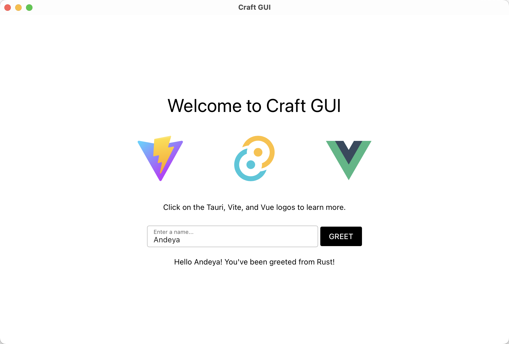

# Craft GUI

Craft GUI = Tauri + Vue(Quasar) + Tailwind + TS + Vite.

<div align="center">
  
</div>

## Getting Started

### Running development server and use Tauri window

After cloning for the first time, change your app identifier inside
`src-tauri/tauri.conf.json` to your own:

```jsonc
{
  // ...
  // The default "com.tauri.craft" will prevent you from building in release mode
  "identifier": "com.my-application-name.app"
  // ...
}
```

Setup pnpm:

```shell
npm install -g pnpm
```

Install and init:

```shell
# rm -rf src-tauri/gen
pnpm install
pnpm tauri android init
pnpm tauri ios init
```

To develop and run the frontend in a Tauri window:

```shell
# For Desktop development, run:
pnpm tauri dev

# For Android development, run:
pnpm tauri android dev

# For iOS development, run:
pnpm tauri ios dev
```

This will load the Next.js frontend directly in a Tauri webview window, in addition to
starting a development server on `localhost:3000`.
Press <kbd>Ctrl</kbd>+<kbd>Shift</kbd>+<kbd>I</kbd> in a Chromium based WebView (e.g. on
Windows) to open the web developer console from the Tauri window.

### Building for release

To export the Next.js frontend via SSG and build the Tauri application for release.

#### For Desktop release

```shell
pnpm tauri build
```

#### For Android release

1. [sign](https://tauri.app/zh-cn/distribute/sign/android/)
2. build

```shell
pnpm tauri android build
```

#### For iOS release

```shell
pnpm tauri ios build
```

```

```
