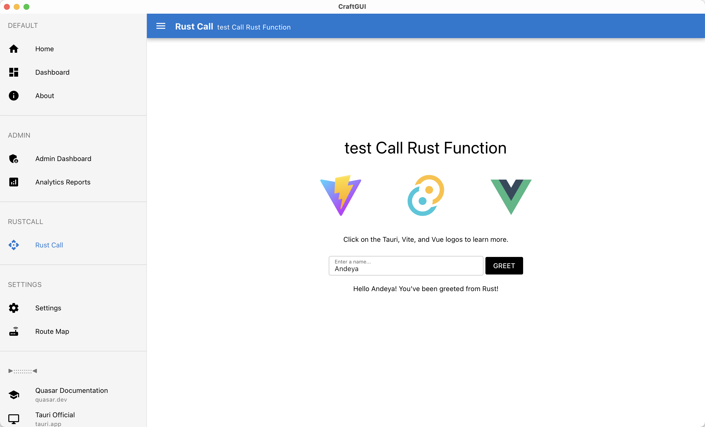

# CraftGUI

A cross-platform application template built with Vue 3 + Quasar + Tauri, featuring innovative automated routing and comprehensive data management systems.

## 📖 Overview

CraftGUI is a modern, feature-rich cross-platform application template that combines the power of Vue 3, Quasar Framework, and Tauri to create desktop and mobile applications. The project stands out with its innovative **Automated Router System** and comprehensive **Application Data Management System**, providing developers with a robust foundation for building complex applications.

### 🎯 Key Highlights

- **🚀 Automated Router System**: Filename-based routing metadata with automatic menu generation
- **📊 Application Data Management**: Schema-based form generation with CRUD operations
- **🔧 Type-Safe Development**: Full TypeScript support throughout the stack
- **📱 Cross-Platform**: Desktop, Android, and iOS support via Tauri
- **🎨 Modern UI**: Quasar Framework with Tailwind CSS for beautiful interfaces
- **⚡ High Performance**: Sled database backend for efficient data storage
- **🛡️ Security First**: Local data storage with no network transmission

### 🏗️ Architecture Excellence

CraftGUI implements clean architecture principles with clear separation of concerns:

- **Frontend**: Vue 3 + TypeScript + Quasar Framework
- **Backend**: Rust + Tauri for cross-platform capabilities
- **Data Layer**: Sled embedded database with JSON Schema validation
- **Routing**: Automated file-based routing with metadata inference
- **Forms**: Dynamic schema-driven form generation

This template is ideal for developers building data-intensive applications, configuration management tools, or any application requiring robust form handling and data persistence.

<div align="center">
  
  
</div>

## Innovative Feature: Filename Prefix Routing Metadata Scheme

This project implements an innovative routing metadata definition scheme that automatically sets the `showInMenu` and `order` properties of routes through filename prefixes.

### Naming Rules

- `001.index.vue` → `showInMenu: true`, `order: 1`, route path: `/index`
- `002.dashboard.vue` → `showInMenu: true`, `order: 2`, route path: `/dashboard`
- `010.admin-home.vue` → `showInMenu: true`, `order: 10`, route path: `/admin/admin-home`
- `hidden-page.vue` → `showInMenu: false`, `order: 0`, route path: `/hidden-page`

### Advantages

1. **Simplified Development**: No need to repeatedly define `showInMenu` and `order` in each component
2. **Intuitive Ordering**: Menu order can be seen directly from the filename
3. **Enforced Standards**: No overrides allowed in components, ensuring naming convention consistency
4. **Consistency**: Unified naming conventions for better team collaboration

For detailed documentation, see: [Router System Documentation](./docs/ROUTER_SYSTEM.md)

## Core Features

### 🚀 Automated Router System

CraftGUI features an innovative **Automated Router System** that combines automatic route generation with filename-based metadata and a clean composables architecture. This system provides a powerful, type-safe, and developer-friendly approach to Vue.js routing.

#### Key Features

- **📁 Filename-Based Metadata**: Use numeric prefixes in filenames to define route metadata
  - `001.example.vue` → `showInMenu: true, order: 1`
  - `005.config.vue` → `showInMenu: true, order: 5`
  - `about.vue` → `showInMenu: false, order: 0`
- **🔄 Automatic Route Generation**: Routes are discovered from the file system
- **📋 Menu Management**: Automatic menu generation based on metadata
- **🏗️ Clean Architecture**: Four clear business domains with single responsibility
- **🔧 Type Safety**: Full TypeScript support with proper interfaces
- **🐛 Developer Experience**: Global console API for debugging and development

#### Architecture

The router system is organized into four clear business domains:

1. **Route Management** - Route data management and querying
2. **Current Route State** - Current route state and metadata
3. **Navigation** - Route navigation operations
4. **Global State** - Global state management and console debugging

#### Quick Start

```vue
<!-- Example: 001.example.vue -->
<template>
  <q-page class="q-pa-md">
    <h1>Example Page</h1>
  </q-page>
</template>

<script setup lang="ts">
// Component logic here
</script>

<script lang="ts">
// Only title, icon, and description allowed
export const meta = {
  title: "Example Page",
  icon: "example",
  description: "Example page description",
};
</script>
```

#### Global Console API

The system provides a global `$router` object in the browser console for debugging:

```javascript
// All available routes
$router.allRoutes;

// Menu routes (routes with showInMenu: true)
$router.menuRoutes;

// Route statistics
$router.stats;

// Find route by path
$router.findRouteByPath("/target-path");
```

For detailed documentation, see: [Router System Documentation](./docs/ROUTER_SYSTEM.md)

### Application Data Management System

CraftGUI includes a comprehensive **Application Data Management System** that provides dynamic, schema-based form generation for managing both application data and configuration settings. This system offers a unified interface for handling structured data through JSON Schema 2020-12 specifications.

#### Key Features

- **🔄 Dynamic Form Generation**: Forms automatically generated from JSON Schema 2020-12 definitions
- **📊 Dual Mode Operation**:
  - **AppData Mode**: Manage user data, product configurations with multiple records
  - **Config Mode**: Manage application settings with single configuration record
- **✅ Built-in Validation**: Real-time validation with JSON Schema compliance
- **🎨 Rich UI Components**: Change tracking, diff views, empty states, and compact mode
- **🔒 Type Safety**: Full TypeScript support with compile-time and runtime validation
- **⚡ High Performance**: Sled database backend with efficient data serialization
- **🛡️ Security**: Local data storage with no network transmission
- **🔧 Extensible**: Easy to add new schemas and field types

#### Architecture

The system consists of three main layers:

1. **Frontend Components** - Vue.js components for data management UI
2. **Backend Services** - Rust services for data persistence and validation
3. **Schema System** - JSON Schema 2020-12 based validation and form generation

#### Quick Start

```vue
<template>
  <!-- AppData Mode - Multiple Records -->
  <SchemaDataForm
    mode="appdata"
    schema-name="UserProfile"
    :data-key="1"
    title="User Profile Management"
    @save="handleSave"
  />

  <!-- Config Mode - Application Settings -->
  <SchemaDataForm
    mode="config"
    schema-name="AppConfig"
    title="Application Settings"
    @save="handleConfigSave"
  />
</template>
```

#### Predefined Schemas

- **UserProfile**: User profile information
- **ProductConfig**: Product configuration data
- **SystemSettings**: System-wide settings
- **AppConfig**: Application configuration

#### Advanced Features

- **Change Tracking**: Visual indicators for modified fields
- **Diff View**: Before-save difference comparison with TextDiffDialog
- **Validation Feedback**: Real-time validation with error messages
- **Empty States**: User-friendly empty state handling
- **Compact Mode**: Toggle between compact and full form layouts
- **Key Management**: Automatic next available key detection
- **Error Handling**: Comprehensive error reporting and recovery

For detailed documentation, see: [Application Data Management System](./docs/APP_DATA_MANAGEMENT_SYSTEM.md)

## Tech Stack

- **Frontend Framework**: [Vue 3](https://vuejs.org/guide/quick-start)
- **UI Framework**: [Quasar](https://quasar.dev/start/quick-start)
- **CSS Components**: [Tailwind CSS 3](https://v3.tailwindcss.com/docs/installation)
- **Cross Framework**: [Tauri](https://tauri.app/start/)
- **Build Tool**: [Vite](https://vite.dev/guide/)
- **Package Manager**: [pnpm](https://pnpm.io/)
- **Database**: [Sled](https://github.com/spacejam/sled)

## Project Structure

```
craft-gui/
├── src/
│   ├── components/
│   │   ├── schemaform/           # Schema-based form components
│   │   │   ├── SchemaDataForm.vue    # Main form component
│   │   │   └── SchemaField.vue   # Individual field renderer
│   │   └── ...
│   ├── pages/
│   │   ├── 004.appdata-demo.vue  # AppData system demo
│   │   ├── 99.settings/          # Settings pages
│   │   └── ...
│   ├── utils/
│   │   ├── tauri-commands.ts     # Tauri command constants
│   │   ├── schema-constants.ts   # Schema definitions
│   │   └── ui-constants.ts       # UI text constants
│   └── types/
│       └── schema.ts             # JSON Schema type definitions
├── src-tauri/
│   └── src/
│       ├── appdata.rs            # AppData backend services
│       └── config.rs             # Configuration backend services
└── docs/
    ├── APP_DATA_MANAGEMENT_SYSTEM.md          # Main documentation
    ├── SCHEMA_FORM_SYSTEM.md                  # Schema system docs
    └── ...
```

## Getting Started

### Running development server and use Tauri window

After cloning for the first time, change your app identifier inside
`src-tauri/tauri.conf.json` to your own:

```jsonc
{
  // ...
  // The default "com.tauri.craft" will prevent you from building in release mode
  "identifier": "com.my-application-name.app"
  // ...
}
```

Setup pnpm:

```shell
npm install -g pnpm
```

Install and init:

```shell
# rm -rf src-tauri/gen
pnpm install
pnpm tauri android init
pnpm tauri ios init
```

To develop and run the frontend in a Tauri window:

```shell
# For Desktop development, run:
pnpm tauri dev

# For Android development, run:
pnpm tauri android dev

# For iOS development, run:
pnpm tauri ios dev
```
